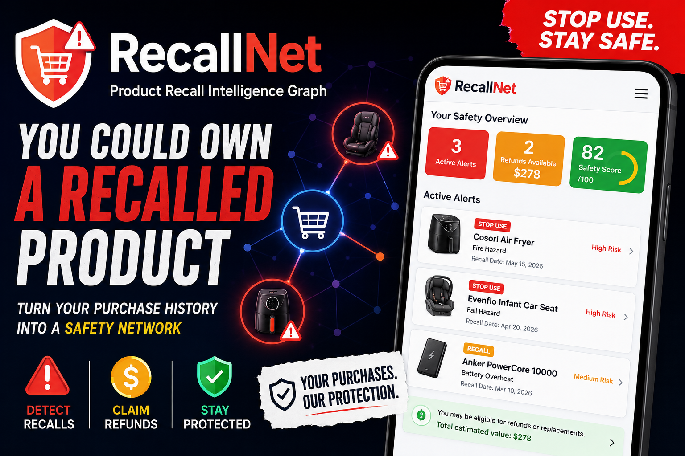
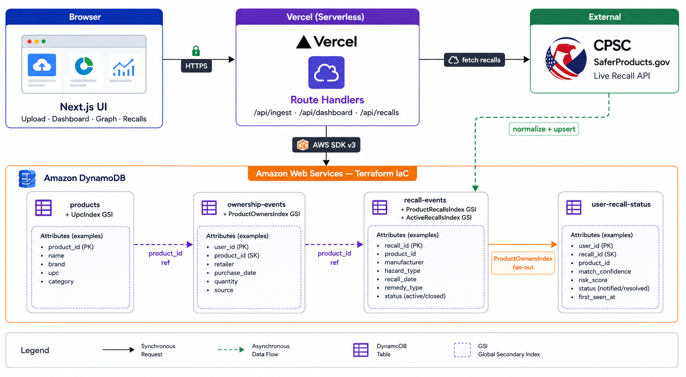

# RecallNet

**Product Recall Intelligence Graph** — connect your purchase history to **live CPSC recall data** and find out, in seconds, whether anything you own has been recalled.

> Upload an order CSV (or scan a barcode, or paste a product list) → real-time [SaferProducts.gov](https://www.saferproducts.gov/) matching → explainable **STOP USE** alerts with remedy eligibility and dollar value.

<p align="center">
  
</p>

**Demo result:** one household cart → **3 live STOP USE recalls** (Cosori air fryer fire hazard · Arizer vaporizer fire/burn · BABESIDE doll choking hazard) → **$459.97 in eligible remedy value** → a "Critical" household safety score with an explainable factor breakdown.

Built for [**H0: Hack the Zero Stack**](https://h01.devpost.com/) — **Next.js on Vercel** + **Amazon DynamoDB**.


## Table of contents

- [Why RecallNet](#why-recallnet)
- [Key features](#key-features)
- [Try it](#try-it)
- [Architecture](#architecture)
- [Data model (Amazon DynamoDB)](#data-model-amazon-dynamodb)
- [Tech stack](#tech-stack)
- [Quick start (local)](#quick-start-local)
- [Production deploy](#production-deploy)
- [Project structure](#project-structure)
- [API reference](#api-reference)
- [Hackathon submission](#hackathon-submission)
- [Documentation](#documentation)
- [Disclaimer](#disclaimer)


## Why RecallNet

Every year, tens of millions of consumer-product units are recalled for fire, burn, and choking hazards. But recall notifications are **inconsistent and fragmented** across Amazon, Target, Walmart, and in-store purchases — so most people own at least one recalled product without ever knowing.

[SaferProducts.gov](https://www.saferproducts.gov/) lets you search **if you already know what to look for**. RecallNet flips that around: it connects what you **own** to every active recall — automatically.

> **Your shopping history should protect you — not sit forgotten in a PDF export.**


## Key features

| Feature | What it does |
| ------- | ------------ |
| **Multi-mode ingest** | Barcode scan (camera), manual entry, bulk order CSV, or free-text product list |
| **Live CPSC matching** | Every product checked against the SaferProducts.gov REST API in real time — **no fake seed data** |
| **Explainable matching** | UPC exact match (HIGH) and brand/name token overlap (MEDIUM) with confidence scores — deterministic, auditable, no black-box LLM as the matcher |
| **Remedy eligibility** | Parses CPSC sale windows from prose ("sold from June 2018 through December 2022") and estimates dollar-value remedy from purchase price |
| **Household safety score** | 0–100 weighted score with a transparent factor breakdown (fire/stop-use, child product, active recall, multiple products) |
| **Prioritized alerts** | Child-safety and STOP USE hazards surface first |
| **Recall fan-out** | When a new CPSC recall publishes, owners are notified via a DynamoDB GSI — O(owners), not a full-table scan |
| **Anonymous share report** | Generate a no-PII household safety report via a shareable token |
| **Personal safety graph** | Visualizes you → products → active recalls |


## Try it

**Live app:** **<https://recall-net.vercel.app>** — running on Amazon DynamoDB (verify at [`/api/health`](https://recall-net.vercel.app/api/health))

Fastest path (no login required):

1. Open `/upload`
2. Select the **Bulk CSV** tab → click **Load video demo CSV (live CPSC products)**
3. Click **Upload CSV & scan** → you're redirected to the dashboard
4. Expect **3 STOP USE alerts** (Cosori, Arizer, BABESIDE), **~$459.97** eligible remedy, and a **Critical** safety score

Other paths:

- **Manual tab:** brand `Cosori`, product name `Dual Blaze Air Fryer` → 1 alert
- **Scan tab:** UPC `628078802274` (Arizer Solo III) → 1 alert
- **`/recalls`:** live CPSC feed + sync
- **`/graph`:** safety graph visualization
- **`/api/health`:** verify the backend — returns `"storage":"dynamodb"` in production


## Architecture

<p align="center">
  
</p>

**Flow:** the Next.js frontend on Vercel calls serverless route handlers, which read/write Amazon DynamoDB via AWS SDK v3 and query the live CPSC API. Recalls are normalized and upserted; alerts are a materialized projection fanned out to affected owners through a GSI.


## Data model (Amazon DynamoDB)

Four PAY_PER_REQUEST tables, provisioned via Terraform ([terraform/dynamodb.tf](terraform/dynamodb.tf)). The model is **event-sourced**: ownership and recall events are append-only streams; alerts are a materialized projection.

| Table | Keys | GSIs | Purpose |
| ----- | ---- | ---- | ------- |
| `recallnet-products` | `productId` | **UpcIndex** (`upc`) | Canonical product catalog; exact-match UPC lookup |
| `recallnet-ownership-events` | `PK=USER#<id>` / `SK=EVENT#<ts>#<id>` | **ProductOwnersIndex** (`productId → user`) | Append-only purchase stream; recall → owners fan-out |
| `recallnet-recall-events` | `PK=RECALL#<id>` / `SK=EVENT#<ts>` | **ProductRecallsIndex** (`productId`), **ActiveRecallsIndex** (`status`) | Immutable recall notices; product lookup + active feed |
| `recallnet-user-recall-status` | `PK=USER#<id>`\|`REPORT#<token>` / `SK=RECALL#<id>`\|`META` | — | Materialized alert projections + share reports |

**Why DynamoDB:** recall fan-out is the core scale pattern — "notify every owner of product X." The `ProductOwnersIndex` GSI turns that from O(all users) into O(owners). Single-digit-millisecond reads, PAY_PER_REQUEST scaling, and no connection-pool management on serverless make it the right fit for a Vercel + AWS "zero stack."

> A local in-memory store ([src/lib/db/memory.ts](src/lib/db/memory.ts)) backs `npm run dev` so you can run the whole app with **zero AWS setup**; production uses DynamoDB ([src/lib/db/dynamodb.ts](src/lib/db/dynamodb.ts)). The backend selection is automatic — see [src/lib/db/client.ts](src/lib/db/client.ts).


## Tech stack

| Layer | Technology |
| ----- | ---------- |
| Frontend | Next.js 14 (App Router) on **Vercel**; prototyped with **v0.app** |
| API | Vercel serverless route handlers |
| Database | **Amazon DynamoDB** (4 tables + 4 GSIs) via AWS SDK v3 |
| Recall data | **CPSC SaferProducts.gov** REST API (live) |
| Barcode | Native `BarcodeDetector` with `@zxing/browser` fallback |
| Infrastructure | **Terraform** (DynamoDB, IAM least-privilege, optional S3) |
| Language | TypeScript (strict), Tailwind CSS |


## Quick start (local)

Runs fully on an in-memory store — **no AWS account needed**.

```bash
cp .env.example .env.local
npm install
npm run dev
```

Open <http://localhost:3001> → go to `/upload` → **Load video demo CSV** → scan against live CPSC recalls.

> The local store is process-wide but **not** shared across serverless instances — production requires DynamoDB.


## Production deploy

```bash
npm run infra:deploy     # Terraform: DynamoDB (4 tables + 4 GSIs) + IAM + optional S3
npm run infra:seed       # Preload the CPSC catalog into DynamoDB
vercel --prod            # Deploy the frontend + API to Vercel
```

Then verify the backend is live on DynamoDB:

```bash
curl https://recall-net.vercel.app/api/health
# → {"status":"ok","storage":"dynamodb","recallSource":"cpsc.gov", ...}
```

Required Vercel environment variables (including `NEXT_PUBLIC_APP_URL`, needed for working share links) are listed in [docs/DEPLOYMENT.md](docs/DEPLOYMENT.md). Full deploy guide: [docs/DEPLOYMENT.md](docs/DEPLOYMENT.md).


## Project structure

```
RecallNet/
├── src/
│   ├── app/                  # Next.js App Router (pages + API routes)
│   │   ├── upload/           # Ingest: scan · manual · CSV · text
│   │   ├── dashboard/        # Alerts, safety score, share report
│   │   ├── recalls/          # Live CPSC feed + sync
│   │   ├── graph/            # Personal safety graph
│   │   ├── report/[token]/   # Public anonymous report
│   │   └── api/              # ingest, dashboard, recalls, report, health
│   ├── components/           # UI: BarcodeScanner, SafetyScoreCard, AlertModal, ...
│   └── lib/
│       ├── db/               # RecallStore: memory + dynamodb + client selector
│       ├── cpsc/             # client, normalize, sale-window, hazard-text
│       ├── matcher.ts        # product ↔ recall matching + ingest
│       ├── eligibility.ts    # sale-window + remedy-value logic
│       ├── dashboard.ts      # dashboard builder
│       ├── risk-score.ts     # household safety score
│       └── sort-alerts.ts    # alert prioritization
├── terraform/                # DynamoDB, IAM, S3 (IaC)
├── scripts/                  # seed-dynamodb, deploy-aws, terraform-env
└── docs/                     # Architecture, Deployment, API, Demo, Submission
```


## API reference

| Endpoint | Method | Purpose |
| -------- | ------ | ------- |
| `/api/health` | GET | Service status + storage mode + catalog size |
| `/api/ingest/csv` | POST | Ingest an order CSV; returns alerts + remedy value |
| `/api/ingest/product` | POST | Ingest a single product (manual / scan) |
| `/api/ingest/text` | POST | Ingest a free-text product list |
| `/api/dashboard` | GET | Dashboard summary, alerts, and products for a user |
| `/api/recalls` | GET/POST | List active recalls / sync from CPSC and notify owners |
| `/api/report/generate` | POST | Create an anonymous shareable report |
| `/api/report/[token]` | GET | Fetch a shared report |

Full request/response schemas: [docs/API.md](docs/API.md).


## Hackathon submission

- **Track:** 1 — Monetizable B2C App (also targeting the **Most Impactful** and **Best Technical Implementation** special prizes)
- **AWS database:** Amazon DynamoDB
- **Frontend:** Vercel (prototyped with v0.app)


## Documentation

| Document | Description |
| -------- | ----------- |
| [docs/README.md](docs/README.md) | Documentation index |
| [docs/ARCHITECTURE.md](docs/ARCHITECTURE.md) | System design, data model, CPSC integration |
| [docs/DEPLOYMENT.md](docs/DEPLOYMENT.md) | Local + AWS + Vercel deploy guide |
| [docs/IMPLEMENTATION.md](docs/IMPLEMENTATION.md) | Codebase guide |
| [docs/API.md](docs/API.md) | REST API reference |
| [docs/TESTING.md](docs/TESTING.md) | Test CSVs, curl examples, expected results |
| [terraform/README.md](terraform/README.md) | Terraform quick reference |

### npm scripts

| Script | Description |
| ------ | ----------- |
| `npm run dev` | Local dev on port 3001 (in-memory store) |
| `npm run build` / `npm run start` | Production build / serve |
| `npm run sync:recalls` | Sync CPSC recalls → DynamoDB |
| `npm run infra:deploy` | Terraform apply (DynamoDB + IAM + S3) |
| `npm run infra:seed` | Seed DynamoDB from CPSC |
| `npm run infra:destroy` | Tear down AWS infrastructure |


## Disclaimer

RecallNet is an **informational tool**. Recall matches are best-effort and may include false positives or miss recalls. Always verify with the manufacturer and the official [CPSC](https://www.cpsc.gov/) / [SaferProducts.gov](https://www.saferproducts.gov/) recall pages before acting. Not affiliated with the CPSC or any retailer.

Built for [H0: Hack the Zero Stack](https://h01.devpost.com/).


## License

MIT — see [LICENSE](LICENSE).
