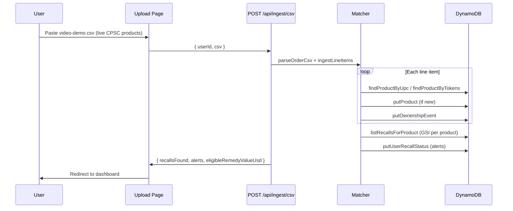
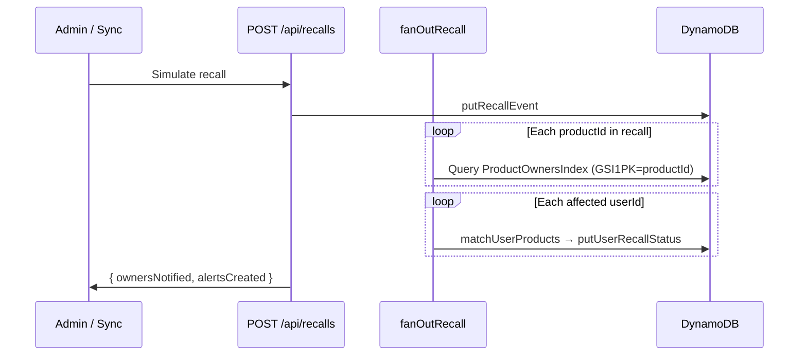

# Architecture

RecallNet connects **what you own** to **what was recalled** using an event-sourced ownership graph stored in DynamoDB. The frontend runs on Vercel; the data plane runs on AWS.

## Design principles

1. **Proactive, not reactive** — Users upload purchase history; the system finds recalls they did not know to search for.
2. **Explainable matching** — UPC exact match and token overlap; no black-box LLM as the primary matcher.
3. **Event-sourced streams** — Ownership and recall events are append-only; alerts are a materialized projection.
4. **GSI fan-out** — When a new recall publishes, query owners by product in O(owners), not O(all users).

## High-level architecture

```
┌─────────────────────────────────────────────────────────────────────────┐
│                           Client (Browser)                              │
│  Landing · Upload · Dashboard · Safety Graph · Recalls · Share Report   │
└─────────────────────────────────┬───────────────────────────────────────┘
                                  │ HTTPS
                                  ▼
┌─────────────────────────────────────────────────────────────────────────┐
│                    Vercel — Next.js 14 App Router                       │
│  ┌──────────────┐  ┌──────────────┐  ┌──────────────────────────────┐  │
│  │ Pages (RSC)  │  │ Client comps │  │ API Route Handlers           │  │
│  │ page.tsx     │  │ Dashboard    │  │ /api/ingest, /api/dashboard  │  │
│  │              │  │ SafetyGraph  │  │ /api/admin/simulate-recall   │  │
│  └──────────────┘  └──────────────┘  └──────────────┬───────────────┘  │
└───────────────────────────────────────────────────────┼─────────────────┘
                                                        │
                        ┌───────────────────────────────┴─────────────────┐
                        │           RecallStore abstraction                 │
                        │  memory.ts (local)  │  dynamodb.ts (production) │
                        └───────────────────────────────┬─────────────────┘
                                                        │ AWS SDK v3
                                                        ▼
┌─────────────────────────────────────────────────────────────────────────┐
│                    AWS (Terraform-managed)                              │
│  ┌─────────────────┐  ┌─────────────────┐  ┌─────────────────────────┐ │
│  │ recallnet-      │  │ recallnet-      │  │ recallnet-recall-events │ │
│  │ products        │  │ ownership-events│  │ + ProductRecallsIndex   │ │
│  │ + UpcIndex GSI  │  │ + ProductOwners │  │ + ActiveRecallsIndex    │ │
│  │                 │  │   Index (GSI)   │  │                         │ │
│  └─────────────────┘  └─────────────────┘  └─────────────────────────┘ │
│  ┌─────────────────────────────────┐  ┌───────────────────────────────┐ │
│  │ recallnet-user-recall-status    │  │ S3 receipts bucket (optional) │ │
│  └─────────────────────────────────┘  └───────────────────────────────┘ │
└─────────────────────────────────────────────────────────────────────────┘
```

## Core domain model

RecallNet models a **personal consumer safety graph**:

```
User (Household)
├── OwnershipEvent stream (append-only purchases)
├── Product nodes
│   ├── RecallEvent links (active + historical)
│   ├── Eligibility state (ELIGIBLE | EXPIRED | UNKNOWN)
│   └── Remedy programs (replacement, refund, repair kit)
└── UserRecallStatus (materialized alerts for dashboard)
```

### Entity relationships

| Entity | Role | Mutability |
| ------ | ---- | ---------- |
| `Product` | Canonical catalog entry | Upsert on ingest |
| `OwnershipEvent` | User purchased/returned a product | Append-only |
| `RecallEvent` | Official recall notice | Append-only (immutable) |
| `UserRecallStatus` | Alert projection for dashboard | Upsert on match/fan-out |
| `ShareReport` | Public read-only safety summary | Create-on-demand |

## Data flow: CSV upload → alerts



## Data flow: new recall → notify owners



**Scale narrative:** If 200,000 households own a recalled Cosori model, one GSI query per product finds all owners — not a full scan of every user in the system.

## DynamoDB schema

Four tables, four GSIs. Table names default to `recallnet-*` (see [terraform/dynamodb.tf](../terraform/dynamodb.tf)).

### `recallnet-products`

| Key | Attribute | Type |
| --- | --------- | ---- |
| Hash | `productId` | String |

Stores brand, model, category, UPC, aliases.

**GSI: `UpcIndex`**

| Key | Attribute |
| --- | --------- |
| Hash | `upc` | String (sparse — only products with UPC) |

**Access pattern:** Barcode scan / CSV UPC column → O(1) product lookup (no table scan).

### `recallnet-ownership-events`

| Key | Attribute | Type |
| --- | --------- | ---- |
| Hash | `PK` | `USER#<userId>` |
| Range | `SK` | `EVENT#<timestamp>#<eventId>` |

**GSI: `ProductOwnersIndex`**

| Key | Attribute |
| --- | --------- |
| Hash | `GSI1PK` = `productId` |
| Range | `GSI1SK` = `USER#<userId>` |

**Access pattern:** New recall for product X → find all owners.

### `recallnet-recall-events`

| Key | Attribute | Type |
| --- | --------- | ---- |
| Hash | `PK` | `RECALL#<recallId>` |
| Range | `SK` | `EVENT#<publishedAt>` |

**GSI: `ProductRecallsIndex`**

| Key | Attribute |
| --- | --------- |
| Hash | `GSI1PK` = `productId` |
| Range | `GSI1SK` = `publishedAt` |

**GSI: `ActiveRecallsIndex`**

| Key | Attribute |
| --- | --------- |
| Hash | `GSI2PK` = `status` (`ACTIVE`) |
| Range | `GSI2SK` = `publishedAt` |

**Access patterns:** Recalls for a product (newest first); active recall feed page.

### `recallnet-user-recall-status`

| Key | Attribute | Type |
| --- | --------- | ---- |
| Hash | `PK` | `USER#<userId>` or `REPORT#<token>` |
| Range | `SK` | `RECALL#<recallId>` or `META` |

Materialized alerts for fast dashboard reads. Share reports use the same table with `PK=REPORT#<token>`.

### Access pattern summary

| Operation | Table / Index |
| --------- | ------------- |
| User dashboard alerts | `UserRecallStatus` PK = `USER#<userId>` |
| User purchase history | `OwnershipEvents` PK = `USER#<userId>` |
| Recalls for product | `RecallEvents` → `ProductRecallsIndex` |
| Owners of product | `OwnershipEvents` → `ProductOwnersIndex` |
| Active recall feed | `RecallEvents` → `ActiveRecallsIndex` |
| Product lookup | `Products` hash key `productId` |
| Share report | `UserRecallStatus` PK = `REPORT#<token>` |

## Recall data source

RecallNet uses the **official CPSC SaferProducts.gov REST API** — not pre-seeded demo records.

| Operation | CPSC endpoint | When |
| --------- | ------------- | ---- |
| Catalog preload | `Recall?RecallDateStart=…&format=json` | App init if catalog empty |
| Per-product lookup (UPC) | `Recall?ProductUPC=…&format=json` | On CSV ingest |
| Per-product lookup (name) | `Recall?ProductName=…&format=json` | On CSV ingest without UPC |
| Live sync | Recent recalls + fan-out | `POST /api/recalls` |

Module: `src/lib/cpsc/` (client, normalize) + `src/lib/recall-sync.ts`

The app uses a `RecallStore` interface ([`src/lib/db/store.ts`](../src/lib/db/store.ts)) with two implementations:

| Implementation | When used | Purpose |
| -------------- | --------- | ------- |
| `memory.ts` | `USE_LOCAL_STORE=true` or no AWS creds | Local dev, demos without AWS |
| `dynamodb.ts` | Production / `USE_LOCAL_STORE=false` | AWS DynamoDB via SDK v3 |

Selection logic in [`src/lib/db/client.ts`](../src/lib/db/client.ts):

- If `USE_LOCAL_STORE=true` → memory
- If no `AWS_ACCESS_KEY_ID` and no `AWS_REGION` → memory
- Else → DynamoDB (falls back to memory if ping fails)

Both stores start empty. Recalls are loaded from **CPSC SaferProducts.gov** via `ensureRecallCatalog()` on first access.

## Matching engine

Deterministic, explainable matching ([`src/lib/matcher.ts`](../src/lib/matcher.ts)):

| Priority | Signal | Confidence |
| -------- | ------ | ------------ |
| 1 | UPC/GTIN exact | HIGH |
| 2 | Brand + model token overlap (≥35%) | MEDIUM |
| 3 | New product created | LOW |

After matching, `evaluateEligibility()` checks purchase date against recall remedy windows ([`src/lib/eligibility.ts`](../src/lib/eligibility.ts)).

## Hero features (v3.1)

| Feature | Module | UI |
| ------- | ------ | -- |
| Household Safety Score | `risk-score.ts` | `SafetyScoreCard.tsx` |
| Safety Graph | `dashboard.ts` | `SafetyGraph.tsx` at `/graph` |
| Recall Explanation | `recall-explanation.ts` | `RecallExplanation.tsx` in alert modal |

### Risk scoring

Composite score 0–100 from weighted factors on the highest-risk alert:

- Fire/stop-use hazard: +45
- Child product: +30
- Active eligible recall: +15
- Kitchen appliance: +15
- Multiple recalled products: +5 each (cap +10)

Bands: Critical (80+), Elevated (50–79), Moderate (20–49), Low (0–19).

## Security model

| Layer | Approach |
| ----- | -------- |
| Authentication | Session ID in `localStorage` (hackathon MVP; no Clerk) |
| AWS credentials | IAM user with least-privilege DynamoDB (+ optional S3) policy |
| Share reports | Token-based public URLs; no PII exposed |
| Data privacy | User purchase data scoped by `userId`; footer disclaimer on all pages |

Post-MVP: Clerk/Auth.js, encrypted PII, admin RBAC, audit logs.

## Post-MVP architecture (spec'd, not built)

| Component | Purpose |
| --------- | ------- |
| EventBridge + DynamoDB Streams | Async recall ingestion pipeline |
| CPSC/FDA RSS poller | Live recall feed |
| Email/SMS (SES/SNS) | STOP USE notifications |
| Community Verification Layer | User-reported outcomes (replacement received, claim denied) |
| Single-table design | `recallnet-main` for enterprise scale |

## Infrastructure as code

AWS resources are provisioned via Terraform in [`terraform/`](../terraform/):

- 4 DynamoDB tables + 4 GSIs
- IAM user for Vercel API routes
- Optional S3 bucket for receipt uploads

See [Deployment Guide](./DEPLOYMENT.md) for step-by-step instructions.
